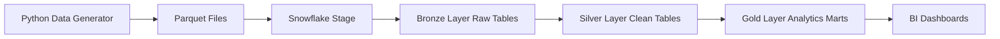
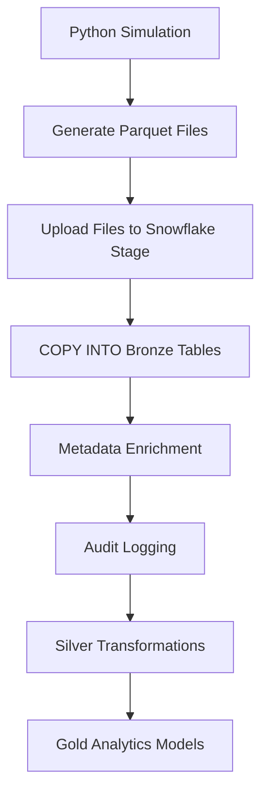

# 🚚 Logistics Snowpark Data Platform


⚠️ **This project is actively under development.**  
Currently the **Bronze layer is complete**, while **Silver and Gold layers are being implemented.**

---

# 📌 Project Overview

This project simulates a **real-world logistics data platform** built using **Snowflake and Snowpark Python**.

The goal is to design a **production-style ingestion framework** capable of handling logistics operations such as:

- Customer onboarding
- Order processing
- Payment events
- Delivery tracking
- Order status events

The platform follows the **Medallion Architecture** used in modern cloud data platforms.

```
Data Generator → Stage → Bronze → Silver → Gold
```

---

# 🏗 System Architecture



### Components

| Layer | Purpose |
|-----|-----|
| Generator | Simulates realistic logistics data |
| Stage | Raw files stored in Snowflake stage |
| Bronze | Raw structured ingestion |
| Silver | Cleaned and transformed data |
| Gold | Business analytics models |

---

# 🔄 Data Flow Diagram



---

# 🧠 Data Generation Layer

Synthetic logistics data is generated using Python libraries:

- Faker
- Pandas
- NumPy

The generator simulates realistic operational events such as:

- Customers placing orders
- Payments processed
- Delivery updates
- Order status transitions

Key features:

- UUID-based primary keys
- Business event timestamps
- Controlled randomness
- Parquet file output

---

# 📦 Stage Layer

Generated Parquet files are uploaded to a Snowflake stage.

```
@LOGISTICS_DB.BRONZE.RAW_STAGE
```

Files are uploaded using **Snowpark Python**:

```python
session.file.put("data/orders.parquet", "@RAW_STAGE")
```

---

# 🥉 Bronze Layer (Completed)

The Bronze layer stores **raw structured data** ingested directly from Parquet files.

Features implemented:

- Structured Parquet ingestion
- Dynamic COPY commands
- Metadata enrichment
- Error handling
- File-level audit logging

---

## Bronze Tables

| Table | Description |
|------|------|
| RAW_CUSTOMERS | Customer master data |
| RAW_ORDERS | Order transactions |
| RAW_PAYMENTS | Payment records |
| RAW_DELIVERIES | Delivery tracking |
| RAW_STATUS | Order status events |

---

## Metadata Columns

Each Bronze table includes metadata columns:

```sql
LOAD_TIMESTAMP TIMESTAMP_LTZ DEFAULT CURRENT_TIMESTAMP(),
LOAD_DATE DATE DEFAULT CURRENT_DATE()
```

Metadata is populated **after COPY execution** to avoid Parquet limitations.

---

# 📊 FILE_LOAD_AUDIT Table

The system maintains an **audit table to track file ingestion activity**.

```sql
CREATE TABLE FILE_LOAD_AUDIT (
    LOAD_ID STRING,
    TABLE_NAME STRING,
    FILE_NAME STRING,
    ROW_COUNT NUMBER,
    LOAD_STATUS STRING,
    LOAD_START_TIME TIMESTAMP,
    LOAD_END_TIME TIMESTAMP,
    ERROR_MESSAGE STRING,
    LOAD_DATE DATE
);
```

This provides:

- Load traceability
- Operational monitoring
- Error visibility
- Pipeline observability

---

# ⚙️ Ingestion Framework

The ingestion framework dynamically processes incoming files.

Key capabilities:

- Pattern-based file routing
- Dynamic COPY execution
- Structured Parquet ingestion
- Metadata handling
- Exception handling
- Audit logging

The framework is designed to simulate **enterprise-scale Snowflake ingestion pipelines**.

---

# 📂 Project Structure

```
LOGISTICS-SNOWPARK-PLATFORM
│
├── data_generation
│   │
│   ├── __pycache__
│   │
│   ├── daily_batches
│   |   ├── customers_*.parquet
│   │   ├── deliveries_*.parquet
│   │   ├── orders_*.parquet
│   │   ├── payments_*.parquet
│   │   ├── status_*.parquet
│   │   └── ...
|   |
│   │
│   ├── generator
│   │   ├── __pycache__
│   │   ├── __init__.py
│   │   ├── generate_customers.py
│   │   ├── generate_deliveries.py
│   │   ├── generate_orders.py
│   │   ├── generate_payments.py
│   │   ├── generate_status_events.py
│   │   └── generate_orders_batch.py
│   │
│   └── orchestrator.py
│
├── fraud_engine
│
├── infra
│   ├── bronze_setup.sql
│   ├── debugging.sql
│   └── setup.sql
│
├── ingestion
│   └── load_raw_orders.py
│
├── metrics
│
├── modeling
│
├── monitoring
│
├── orchestration
│
├── .env
├── .env.example
├── .gitignore
├── python
├── requirements.txt
└── README.md

---

# 🔁 Pipeline Execution

Pipeline execution flow:

1. Generate synthetic logistics data  
2. Export datasets to **Parquet files**  
3. Upload files to **Snowflake stage**  
4. Execute **COPY INTO Bronze tables**  
5. Populate metadata columns  
6. Record ingestion activity in **FILE_LOAD_AUDIT**

---

# 🚧 Silver Layer (In Progress)

The Silver layer will implement:

- Timestamp normalization
- Data deduplication
- Incremental MERGE logic
- Late-arriving event handling
- Data validation rules
- Clean analytical models

---

# 🥇 Gold Layer (Planned)

Analytics-ready marts will be created for:

| Mart | Description |
|----|----|
| Order Lifecycle Mart | Order lifecycle analysis |
| Customer 360 | Customer insights |
| Payment Performance | Payment success rates |
| Delivery SLA | Delivery performance metrics |

---

# 📊 Future Dashboards

Planned analytics dashboards:

- Order Funnel
- Delivery SLA Monitoring
- Customer Retention
- Payment Success Rates

---

# 🛠 Technology Stack

| Category | Tools |
|------|------|
| Data Warehouse | Snowflake |
| Processing | Snowpark Python |
| Data Format | Parquet |
| Programming | Python |
| Libraries | Pandas, NumPy, Faker |
| Version Control | Git & GitHub |

---

# ▶️ How To Run

### 1️⃣ Install dependencies

```bash
pip install -r requirements.txt
```

### 2️⃣ Configure environment

Create a `.env` file and add Snowflake credentials.

Use `.env.example` as reference.

---

### 3️⃣ Run ingestion

Example:

```bash
python ingestion/load_raw_orders.py
```

---

# 📸 Screenshots (Coming Soon)

Examples that will be added:

- Snowflake tables
- Query execution
- COPY command logs
- Audit table monitoring

---

# 📈 Project Status

| Layer | Status |
|------|------|
| Data Generator | ✅ Complete |
| Stage Layer | ✅ Complete |
| Bronze Layer | ✅ Complete |
| Silver Layer | 🚧 In Development |
| Gold Layer | ⬜ Planned |

---

# 🎯 Learning Outcomes

This project demonstrates:

- Snowflake structured data ingestion
- Handling Parquet COPY limitations
- Metadata management in Bronze layer
- File-level ingestion auditing
- Enterprise ingestion framework design
- Medallion architecture implementation

---

# 🚀 Future Enhancements

Planned improvements include:

- Idempotent file ingestion
- Stream + Task automation
- Incremental pipeline orchestration
- Data quality validation framework
- CI/CD integration

---

# 👨‍💻 Author

**Shivam Mishra**

Snowflake Data Engineering Enthusiast  
Building production-style cloud data platforms 🚀

LinkedIn  
https://www.linkedin.com/in/shivammishra-sm/

GitHub  
https://github.com/Shivam24012001

Portfolio  
https://shivam24012001.github.io/