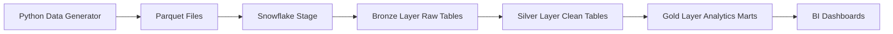
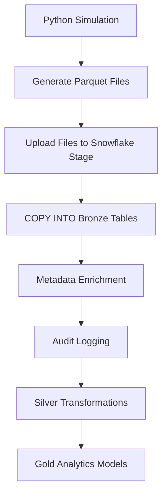

# 🚚 Logistics Snowpark Data Platform


⚠️ **This project is actively under development.**  
Fully Production-Ready End-to-End Data Pipeline **(Bronze → Silver → Gold)**

---

# 📌 Project Overview

This project simulates a **real-world logistics data platform** built using **Snowflake and Snowpark Python**.

The goal is to design a **production-style ingestion framework** capable of handling logistics operations such as:

- Customer onboarding
- Order processing
- Payment events
- Delivery tracking
- Order status events

The platform follows the **Medallion Architecture** used in modern cloud data platforms.

```
Data Generator → Stage → Bronze → Silver → Gold
```

---

# 🏗 System Architecture


```mermaid
flowchart LR

A[Python Data Generator] --> B[Parquet Files]

B --> C[Snowflake Stage]

C --> D[Bronze Layer Raw Tables]

D --> E[Silver Layer Clean Tables]

E --> F[Gold Layer Analytics Marts]

F --> G[BI Dashboards]
```

### Components

| Layer | Purpose |
|-----|-----|
| Generator | Simulates realistic logistics data |
| Stage | Raw files stored in Snowflake stage |
| Bronze | Raw structured ingestion |
| Silver | Cleaned and transformed data |
| Gold | Business analytics models |

---

# 🔄 Data Flow Diagram


```mermaid
flowchart TD

A[Python Simulation] --> B[Generate Parquet Files]

B --> C[Upload Files to Snowflake Stage]

C --> D[COPY INTO Bronze Tables]

D --> E[Metadata Enrichment]

E --> F[Audit Logging]

F --> G[Silver Transformations]

G --> H[Gold Analytics Models]
```
--- 
# 📂 Project Structure

```
LOGISTICS-SNOWPARK-PLATFORM
│
├── data_generation/
│   ├── batches/
│   │   └── orders/
│   │       └── 2026/
│   │           └── 03/
│   │               ├── 08/
│   │               ├── 14/
│   │               ├── 15/
│   │               ├── 22/
│   │               └── 23/
│   │
│   ├── daily_batches/
│   │
│   ├── generator/
│   │   ├── __init__.py
│   │   ├── generate_customers.py
│   │   ├── generate_deliveries.py
│   │   ├── generate_orders.py
│   │   ├── generate_payments.py
│   │   └── generate_status_events.py
│   │
│   ├── generate_orders_batch.py
│   ├── missing_file.py
│   └── orchestrator.py
│
├── infrastructure/
│   ├── bronze_setup/
│   │   ├── bronze_setup.sql
│   │   ├── customer_setup.sql
│   │   ├── deliveries_setup.sql
│   │   ├── order_setup.sql
│   │   ├── payment_setup.sql
│   │   └── status_setup.sql
│   │
│   ├── bronze_streams/
│   │   ├── customers_streams.sql
│   │   ├── deliveries_stream.sql
│   │   ├── orders_stream.sql
│   │   ├── payments_stream.sql
│   │   └── status_stream.sql
│   │
│   ├── silver_setup/
│   │   ├── customers.sql
│   │   ├── deliveries.sql
│   │   ├── orders.sql
│   │   ├── payments.sql
│   │   ├── status.sql
│   │   ├── debugging.sql
│   │   └── setup.sql
│   │
│   ├── gold_setup/
│   │   ├── fact_customer.sql
│   │   ├── fact_deliveries.sql
│   │   ├── fact_orders.sql
│   │   ├── fact_payments.sql
│   │   └── fact_status.sql
│   │
│   └── pipe/
│       ├── customer_pipe.sql
│       ├── deliveries_pipe.sql
│       ├── orders_pipe.sql
│       ├── payment_pipe.sql
│       ├── status_pipe.sql
│       └── master_task_refresh.sql
│
├── ingestion/
│   └── load_raw_orders.py
│
├── transformations/
│   ├── silver/
│   │   ├── deliveries.sql
│   │   ├── initial_load_customers.sql
│   │   ├── initial_load_orders.sql
│   │   ├── initial_load_payments.sql
│   │   ├── merge_customers.sql
│   │   └── status.sql
│   │
│   ├── silver_task/
│   │   ├── controller_task.sql
│   │   ├── customers_task.sql
│   │   ├── deliveries_task.sql
│   │   ├── orders_task.sql
│   │   ├── payments_task.sql
│   │   └── status_task.sql
│   │
│   ├── gold/
│   │   ├── Star_Table/
│   │   │   ├── fact_customer.sql
│   │   │   ├── fact_deliveries.sql
│   │   │   ├── fact_orders.sql
│   │   │   ├── fact_payments.sql
│   │   │   └── fact_status.sql
│   │   │
│   │   ├── kpi/
│   │   │   └── kpi_daily.sql
│   │   │
│   │   ├── fraud/
│   │   │
│   │   └── task_controller.sql
│   │
│   └── stream_task/
│       ├── stream.sql
│       └── ORDERS_ENRICHED.sql
│
├── metrics/
│   └── revenue.sql
│
├── orchestration/
│   └── airflow_dag.py
│
├── monitoring/
│
├── modeling/
│
├── fraud_engine/
│
├── .env
├── .env.example
├── .gitignore
├── requirements.txt
└── README.md
```
---

# 🧠 Data Generation Layer

Synthetic logistics data is generated using Python libraries:

- Faker
- Pandas
- NumPy

The generator simulates realistic operational events such as:

- Customers placing orders
- Payments processed
- Delivery updates
- Order status transitions

Key features:

- UUID-based primary keys
- Business event timestamps
- Controlled randomness
- Parquet file output

---

# 📦 Stage Layer

Generated Parquet files are uploaded to a Snowflake stage.

```
@LOGISTICS_DB.BRONZE.RAW_STAGE
```

Files are uploaded using **Snowpark Python**:

```python
session.file.put("data/orders.parquet", "@RAW_STAGE")
```

---

# 🥉 Bronze Layer (Completed)

The Bronze layer stores **raw structured data ingested** directly from Parquet files using Snowpipe (auto-ingest).

This layer acts as the **source of truth**, preserving data in its original form for downstream processing.

Features implemented:

- Automated ingestion using Snowpipe  
- Continuous file ingestion from Snowflake Stage  
- Event-driven data loading (no manual trigger)  
- Near real-time ingestion pipeline  
- Metadata enrichment (LOAD_TIMESTAMP, LOAD_DATE)  
- Error handling and load tracking  
- File-level audit logging using FILE_LOAD_AUDIT  
- Scalable and serverless ingestion architecture  

---

## Snowpipe Ingestion Flow

- Parquet Files → Snowflake Stage → Snowpipe → Bronze Tables


---

## Bronze Tables

| Table | Description |
|------|------|
| RAW_CUSTOMERS | Customer master data |
| RAW_ORDERS | Order transactions |
| RAW_PAYMENTS | Payment records |
| RAW_DELIVERIES | Delivery tracking |
| RAW_STATUS | Order status events |

---

## Metadata Columns

Each Bronze table includes metadata columns:

```sql
LOAD_TIMESTAMP TIMESTAMP_LTZ DEFAULT CURRENT_TIMESTAMP(),
LOAD_DATE DATE DEFAULT CURRENT_DATE()

Metadata is populated after ingestion, as Parquet files do not support default column values during load.

---

# 📊 FILE_LOAD_AUDIT Table

The system maintains an **audit table to track file ingestion activity**.

```sql
CREATE TABLE FILE_LOAD_AUDIT (
    LOAD_ID STRING,
    TABLE_NAME STRING,
    FILE_NAME STRING,
    ROW_COUNT NUMBER,
    LOAD_STATUS STRING,
    LOAD_START_TIME TIMESTAMP,
    LOAD_END_TIME TIMESTAMP,
    ERROR_MESSAGE STRING,
    LOAD_DATE DATE
);
```

This provides:

- Load traceability
- Operational monitoring
- Error visibility
- Pipeline observability

---

# ⚙️ Ingestion Framework

The ingestion framework dynamically processes incoming files.

Key capabilities:

- Pattern-based file routing
- Automated ingestion using Snowpipe (no manual COPY required)
- Metadata handling and enrichment
- Exception handling and retry logic
- Audit logging for monitoring

The framework is designed to simulate **enterprise-scale Snowflake ingestion pipelines**.

---

# 🔁 Pipeline Execution

Pipeline execution flow:

1. Generate synthetic logistics data  
2. Export data into **Parquet files**  
3. Upload files to **Snowflake stage**  
4. Automatically ingest data into Bronze using **Snowpipe**  
5. Track incremental changes using **Streams (CDC)**  
6. Apply transformations in **Silver layer using MERGE logic**  
7. Build **Gold layer (Star Schema models)** using Tasks  
8. Produce business-ready datasets and KPIs  

---

# 🥈 Silver Layer (Completed)

The Silver layer is responsible for **cleaning, standardizing, and incrementally transforming data**.

Features implemented:

- Standardized timestamps across datasets  
- Deduplicated records using business keys  
- Incremental processing using **MERGE statements**  
- Handling of late-arriving data  
- Data validation and cleanup  
- Entity-level transformations across:
  - Customers  
  - Orders  
  - Payments  
  - Deliveries  
  - Status events  

---

# 🥇 Gold Layer (Completed)

The Gold layer provides **analytics-ready data models** designed for business reporting.

Analytics marts:

| Mart | Description |
|----|----|
| Order Lifecycle | Tracks the complete journey of an order |
| Customer 360 | Consolidated view of customer behavior |
| Payment Performance | Success and failure analysis of payments |
| Delivery SLA | Measures delivery efficiency and timelines |

---

# ⚡ Streams & Tasks

- Streams are used to capture **incremental changes (CDC)** from Bronze  
- Tasks automate the transformation pipeline across layers  
- Execution is dependency-driven (Bronze → Silver → Gold)  
- Enables near real-time data availability  

---

# 📊 Business KPIs

- Daily Revenue  
- Average Order Value (AOV)  
- Delivery SLA performance  
- Payment success rate  
- Order lifecycle metrics  

---

# 📊 Future Dashboards

Planned dashboards:

- Order Funnel  
- Delivery SLA Monitoring  
- Customer Retention  
- Payment Performance  

---

# 🛠 Technology Stack

| Category | Tools |
|------|------|
| Data Warehouse | Snowflake |
| Processing | Snowpark Python |
| Data Pipeline | Snowpipe, Streams, Tasks |
| Orchestration | Airflow |
| Data Format | Parquet |
| Programming | Python, SQL |
| Libraries | Pandas, NumPy, Faker |
| Version Control | Git & GitHub |

---

# ▶️ How To Run

### 1️⃣ Install dependencies

```bash
pip install -r requirements.txt
```

### 2️⃣ Configure environment

Create a `.env` file and add Snowflake credentials.

Use `.env.example` as reference.

---

### 3️⃣ Run ingestion

Example:

```bash
python ingestion/load_raw_orders.py
```

---

# 📸 Screenshots (Coming Soon)

Examples that will be added:

- Snowflake tables
- Query execution
- COPY command logs
- Audit table monitoring

---

# 📈 Project Status

| Layer | Status |
|------|------|
| Data Generator | ✅ Complete |
| Stage Layer | ✅ Complete |
| Bronze Layer | ✅ Complete |
| Silver Layer | ✅ Complete |
| Gold Layer |✅ Complete |

---

# 🎯 Learning Outcomes

This project demonstrates:

- Snowflake structured data ingestion
- Handling Parquet COPY limitations
- Metadata management in Bronze layer
- File-level ingestion auditing
- Enterprise ingestion framework design
- Medallion architecture implementation

---

# 🚀 Future Enhancements

Planned improvements include:

- Idempotent file ingestion
- Stream + Task automation
- Incremental pipeline orchestration
- Data quality validation framework
- CI/CD integration

---

# 👨‍💻 Author

**Shivam Mishra**

Snowflake Data Engineering Enthusiast  
Building production-style cloud data platforms 🚀

LinkedIn  
https://www.linkedin.com/in/shivammishra-sm/

GitHub  
https://github.com/Shivam24012001

Portfolio  
https://shivam24012001.github.io/