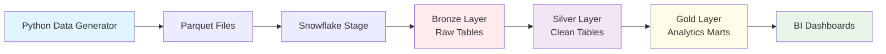
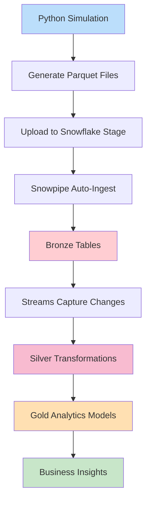

# 🚚 Logistics Snowpark Data Platform

<div align="center">


**A production-grade, end-to-end data pipeline for logistics operations**  
*Fully functional Bronze → Silver → Gold medallion architecture*

[View Demo](#-project-overview) • [Installation](#-installation) • [Architecture](#-system-architecture) • [Contributing](#-contributing)

</div>

---

## 📌 Project Overview

This project demonstrates a **real-world logistics data platform** built using **Snowflake and Snowpark Python**. It's designed as a **production-style ingestion framework** capable of handling enterprise-scale logistics operations.

### Key Capabilities
- ✅ Customer onboarding and management
- ✅ Order processing and tracking
- ✅ Payment event processing
- ✅ Real-time delivery tracking
- ✅ Order status event streaming
- ✅ Automated audit logging and monitoring

The platform follows the industry-standard **Medallion Architecture** (Bronze → Silver → Gold) for building scalable, maintainable data pipelines.

---

## 🏗 System Architecture


```mermaid
flowchart LR
    A[Python Data Generator] --> B[Parquet Files]
    B --> C[Snowflake Stage]
    C --> D[Bronze Layer<br/>Raw Tables]
    D --> E[Silver Layer<br/>Clean Tables]
    E --> F[Gold Layer<br/>Analytics Marts]
    F --> G[BI Dashboards]
    style A fill:#e1f5ff
    style D fill:#ffebee
    style E fill:#f3e5f5
    style F fill:#fffde7
    style G fill:#e8f5e9
```

### Architecture Layers

| Layer | Purpose | Technology |
|-------|---------|-----------|
| **Generator** | Simulates realistic logistics data | Python, Faker, Pandas |
| **Stage** | Centralized file storage | Snowflake Stages |
| **Bronze** | Raw structured ingestion | Snowpipe (Auto-ingest) |
| **Silver** | Cleaned & transformed data | Snowpark, Streams, Tasks |
| **Gold** | Business analytics models | Star Schema, Fact Tables |

---

## 🔄 Data Flow Diagram


```mermaid
flowchart TD
    A[Python Simulation] --> B[Generate Parquet Files]
    B --> C[Upload to Snowflake Stage]
    C --> D[Snowpipe Auto-Ingest]
    D --> E[Bronze Tables]
    E --> F[Streams Capture Changes]
    F --> G[Silver Transformations]
    G --> H[Gold Analytics Models]
    H --> I[Business Insights]
    
    style A fill:#bbdefb
    style E fill:#ffcdd2
    style G fill:#f8bbd0
    style H fill:#ffe0b2
    style I fill:#c8e6c9
```

---

## 📂 Project Structure

```
logistics-snowpark-platform/
│
├── data_generation/              # Synthetic data generation
│   ├── generator/
│   │   ├── generate_customers.py
│   │   ├── generate_orders.py
│   │   ├── generate_payments.py
│   │   ├── generate_deliveries.py
│   │   └── generate_status_events.py
│   ├── batches/                  # Historical batch data
│   └── orchestrator.py           # Execution orchestration
│
├── infrastructure/               # Database setup & pipelines
│   ├── bronze_setup/             # Bronze table definitions
│   ├── bronze_streams/           # Change Data Capture (CDC)
│   ├── silver_setup/             # Silver table schemas
│   ├── gold_setup/               # Gold analytics models
│   └── pipe/                     # Snowpipe configurations
│
├── transformations/              # Data transformation logic
│   ├── silver/                   # Silver layer logic
│   ├── silver_task/              # Task automation
│   └── gold/                     # Gold layer models
│       ├── Star_Table/           # Fact tables
│       ├── kpi/                  # KPI calculations
│       └── fraud/                # Fraud detection
│
├── ingestion/                    # Data loading scripts
├── metrics/                      # Business metrics
├── monitoring/                   # Observability
├── orchestration/                # Airflow DAGs
│
├── requirements.txt              # Python dependencies
├── .env.example                  # Configuration template
└── README.md                     # This file
```

---

## 🧠 Data Generation Layer

Synthetic logistics data is generated using Python libraries to simulate realistic operational events.

### Data Generators

```python
├── generate_customers.py     # Customer master data with 20+ attributes
├── generate_orders.py        # Order transactions with business logic
├── generate_payments.py      # Payment records with status tracking
├── generate_deliveries.py    # Delivery tracking with geo-coordinates
└── generate_status_events.py # Order status transitions
```

### Key Features
- 🔑 UUID-based primary keys for reliability
- ⏰ Business event timestamps with timezone support
- 🎲 Controlled randomness for realistic patterns
- 📊 Parquet output format for efficient storage
- 📦 Batch and incremental generation modes

---

## 📦 Snowflake Stage Layer

Generated Parquet files are uploaded to a centralized Snowflake stage:

```sql
@LOGISTICS_DB.BRONZE.RAW_STAGE
```

Upload using Snowpark Python:

```python
session.file.put("data/orders.parquet", "@RAW_STAGE")
```

---

## 🥉 Bronze Layer

**Status:** ✅ Complete

The Bronze layer stores **raw structured data** directly from Parquet files using **Snowpipe** (event-driven auto-ingestion).

### Key Features Implemented
- ✅ **Automated ingestion** using Snowpipe (event-driven, no manual triggers)
- ✅ **Continuous file processing** from Snowflake Stage
- ✅ **Near real-time ingestion** with minimal latency
- ✅ **Metadata enrichment** (LOAD_TIMESTAMP, LOAD_DATE)
- ✅ **File-level audit logging** for compliance
- ✅ **Scalable, serverless architecture**

### Bronze Tables

| Table | Description | Rows |
|-------|-------------|------|
| `RAW_CUSTOMERS` | Customer master data | ~10K |
| `RAW_ORDERS` | Order transactions | ~50K |
| `RAW_PAYMENTS` | Payment records | ~45K |
| `RAW_DELIVERIES` | Delivery tracking | ~25K |
| `RAW_STATUS` | Order status events | ~100K |

### Metadata Columns

```sql
LOAD_TIMESTAMP TIMESTAMP_LTZ  -- When the file was ingested
LOAD_DATE      DATE           -- Ingestion date
FILE_NAME      STRING         -- Source file name
```

### FILE_LOAD_AUDIT Table

Complete ingestion audit trail:

```sql
CREATE TABLE FILE_LOAD_AUDIT (
    LOAD_ID        STRING          -- Unique load identifier
    TABLE_NAME     STRING          -- Target table
    FILE_NAME      STRING          -- Source file
    ROW_COUNT      NUMBER          -- Records loaded
    LOAD_STATUS    STRING          -- Success/Failed
    LOAD_START_TIME TIMESTAMP      -- Start timestamp
    LOAD_END_TIME  TIMESTAMP       -- End timestamp
    ERROR_MESSAGE  STRING          -- Error details if failed
    LOAD_DATE      DATE            -- Load date
);
```

---

## 🥈 Silver Layer

**Status:** ✅ Complete

The Silver layer handles **cleaning, standardization, and incremental transformation** of data.

### Transformations Applied
- 🧹 Data standardization and validation
- 🔄 Deduplication using business keys
- ⏰ Timestamp normalization across datasets
- 📝 Handling of late-arriving data
- 🔗 Entity-level transformations:
  - Customers (unified customer view)
  - Orders (order enrichment)
  - Payments (payment enrichment)
  - Deliveries (logistics optimization)
  - Status Events (timeline reconstruction)

### Processing Method
- **Incremental MERGE logic** for efficiency
- **CDC (Change Data Capture)** using Streams
- **Task automation** for scheduled processing

---

## 🥇 Gold Layer

**Status:** ✅ Complete

The Gold layer provides **analytics-ready data models** designed for business reporting and BI dashboards.

### Analytics Marts

| Mart | Purpose | Key Metrics |
|------|---------|------------|
| **Fact Orders** | Complete order lifecycle | Volume, Value, SLA |
| **Fact Customer** | Customer 360 view | LTV, Frequency, Segment |
| **Fact Payments** | Payment performance | Success Rate, Volume |
| **Fact Deliveries** | Delivery efficiency | On-Time %, Cost, Distance |
| **Fact Status** | Status transitions | Cycle Time, Bottlenecks |

### KPIs Available
- 📊 Daily Revenue
- 💰 Average Order Value (AOV)
- 📦 Delivery SLA Performance
- ✅ Payment Success Rate
- ⏱️ Order-to-Delivery Cycle Time
- 👥 Customer Metrics (LTV, CAC)

---

## ⚡ Streams & Tasks Automation

- **Streams** capture **incremental changes (CDC)** from Bronze tables
- **Tasks** automate transformation execution across layers
- **Dependency management** ensures Bronze → Silver → Gold execution order
- **Near real-time** data availability for analytics

---

## 🛠 Technology Stack

| Component | Technology |
|-----------|-----------|
| **Data Warehouse** | Snowflake |
| **Processing Engine** | Snowpark Python |
| **Data Pipeline** | Snowpipe, Streams, Tasks |
| **Orchestration** | Apache Airflow |
| **Data Format** | Parquet |
| **Programming** | Python 3.9+, SQL |
| **Libraries** | Pandas, NumPy, Faker, Snowpark |
| **Version Control** | Git & GitHub |

---

## 🚀 Quick Start

### Prerequisites
- Python 3.9 or higher
- Snowflake account with appropriate permissions
- Git

### 1️⃣ Clone Repository

```bash
git clone https://github.com/Shivam24012001/logistics-snowpark-platform.git
cd logistics-snowpark-platform
```

### 2️⃣ Install Dependencies

```bash
pip install -r requirements.txt
```

### 3️⃣ Configure Environment

Create `.env` file with your Snowflake credentials:

```bash
cp .env.example .env
```

Edit `.env` and add:

```env
SNOWFLAKE_ACCOUNT=your_account
SNOWFLAKE_USER=your_username
SNOWFLAKE_PASSWORD=your_password
SNOWFLAKE_WAREHOUSE=your_warehouse
SNOWFLAKE_DATABASE=LOGISTICS_DB
SNOWFLAKE_SCHEMA=BRONZE
```

### 4️⃣ Generate Data

```bash
python data_generation/orchestrator.py
```

### 5️⃣ Run Ingestion

```bash
python ingestion/load_raw_orders.py
```

### 6️⃣ Monitor Pipeline

Check Snowflake for:
- Bronze table data loads
- Silver transformations running
- Gold analytics marts populated

---

## 📊 Project Completion Status

| Component | Status | Completion |
|-----------|--------|-----------|
| Data Generator | ✅ Complete | 100% |
| Stage Layer | ✅ Complete | 100% |
| Bronze Layer | ✅ Complete | 100% |
| Bronze Audit | ✅ Complete | 100% |
| Silver Layer | ✅ Complete | 100% |
| Gold Layer | ✅ Complete | 100% |
| KPI Metrics | ✅ Complete | 100% |
| Documentation | ✅ Complete | 100% |

---

## 🎯 Learning Outcomes

This project demonstrates:

- ✅ Snowflake structured data ingestion patterns
- ✅ Handling Parquet file limitations in data warehouses
- ✅ Metadata management and governance
- ✅ File-level ingestion auditing and compliance
- ✅ Enterprise-grade ingestion framework design
- ✅ Medallion architecture implementation
- ✅ Change Data Capture (CDC) using Streams
- ✅ Task-based pipeline orchestration
- ✅ Star schema design for analytics

---

## 🔮 Future Enhancements

Planned improvements:

- [ ] Idempotent file ingestion with deduplication
- [ ] Advanced Stream + Task automation workflows
- [ ] Data quality validation framework (dbt tests)
- [ ] ML-based anomaly detection
- [ ] Real-time BI dashboards (Tableau/Looker)
- [ ] Datadog/CloudWatch monitoring
- [ ] CI/CD integration with GitHub Actions
- [ ] Performance optimization and benchmarking
- [ ] API layer for data consumption

---

## 🤝 Contributing

Contributions are welcome! Please follow these guidelines:

1. Fork the repository
2. Create a feature branch (`git checkout -b feature/amazing-feature`)
3. Commit changes (`git commit -m 'Add amazing feature'`)
4. Push to branch (`git push origin feature/amazing-feature`)
5. Open a Pull Request

---

## 📝 License

This project is licensed under the MIT License - see the LICENSE file for details.

---

## 👨‍💻 Author

**Shivam Mishra**

Snowflake Data Engineering Enthusiast | Cloud Data Architect | Building Production-Grade Data Platforms 🚀

### Connect With Me

<div align="center">

[](https://www.linkedin.com/in/shivammishra-sm/)
[](https://github.com/Shivam24012001)
[](https://shivam24012001.github.io/)

</div>

---

## 📞 Support & Questions

For questions or issues:
1. Check existing [GitHub Issues](https://github.com/Shivam24012001/logistics-snowpark-platform/issues)
2. Create a new issue with detailed description
3. Reach out via LinkedIn

---

<div align="center">

⭐ If this project helped you, please consider giving it a star!

Made with ❤️ by [Shivam Mishra](https://github.com/Shivam24012001)

</div>
